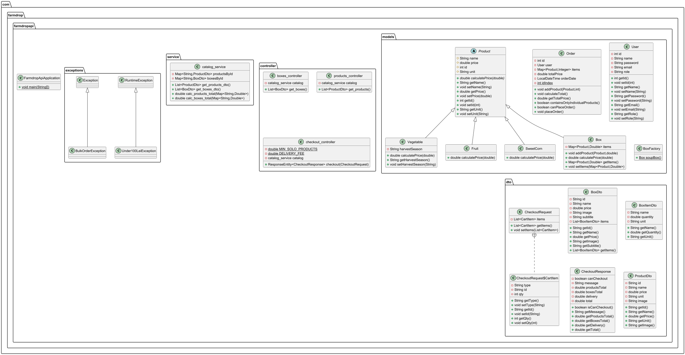

# FarmDrop

FarmDrop is a web app for a local farm that lets customers browse and order fresh produce — either individual products or pre-made weekly boxes. The project has a Spring Boot REST API backend and a plain HTML/CSS/JS frontend.



---

## Project structure

```
FarmDropApp/
├── backend/       Spring Boot REST API (Java 17)
├── frontend/      HTML, CSS, JavaScript client
├── test.puml      PlantUML source for the class diagram
└── DIAGRAMA_CLASE.png
```

---

## Tech stack

| Layer    | Technology                         |
|----------|------------------------------------|
| Backend  | Java 17, Spring Boot 4, Maven      |
| Frontend | HTML5, CSS3, Vanilla JavaScript    |
| API      | REST (JSON), CORS enabled          |
| Data     | In-memory (no database)            |

---

## How to run

### 1. Start the backend

You need **Java 17 or higher** installed. No database setup required — all data is in memory.

```bash
cd backend
./mvnw spring-boot:run        # Mac / Linux
mvnw.cmd spring-boot:run      # Windows
```

The API starts on **http://localhost:8080**.

### 2. Open the frontend

Open `frontend/index.html` directly in your browser.

> Tip: if you use VS Code, install the **Live Server** extension, right-click `index.html` and choose *Open with Live Server* — this avoids any browser security restrictions around local files.

The frontend calls `localhost:8080` automatically, so the backend must be running first.

---

## API endpoints

| Method | Path             | Description                              |
|--------|------------------|------------------------------------------|
| GET    | `/api/products`  | Returns all individual products          |
| GET    | `/api/boxes`     | Returns all pre-made produce boxes       |
| POST   | `/api/checkout`  | Validates cart and returns order summary |

### Checkout rules

- **Boxes only** — always allowed
- **Individual products only** — minimum order of 100 lei
- **Mixed cart (products + boxes)** — always allowed
- Delivery fee: 5 lei (added automatically when checkout is valid)

---

## OOP design highlights

The domain model uses classical OOP patterns:

- **Inheritance** — `Vegetable`, `Fruit`, and `SweetCorn` all extend `Product`; `Box` also extends `Product`
- **Polymorphism** — each subclass overrides `calculatePrice()` with its own pricing logic (e.g. SweetCorn applies a bulk discount over quantity 50)
- **Factory pattern** — `BoxFactory` creates pre-defined box configurations
- **Custom exceptions** — `Under100LeiException` and `BulkOrderException` enforce business rules at the model layer

---

## Pages

| Page             | Description                              |
|------------------|------------------------------------------|
| `index.html`     | Landing page with hero and service cards |
| `products.html`  | Browse individual products, add to cart  |
| `boxes.html`     | Browse pre-made boxes, add to cart       |
| `cart.html`      | Review cart and proceed to checkout      |
| `signup.html`    | Sign up form                             |
